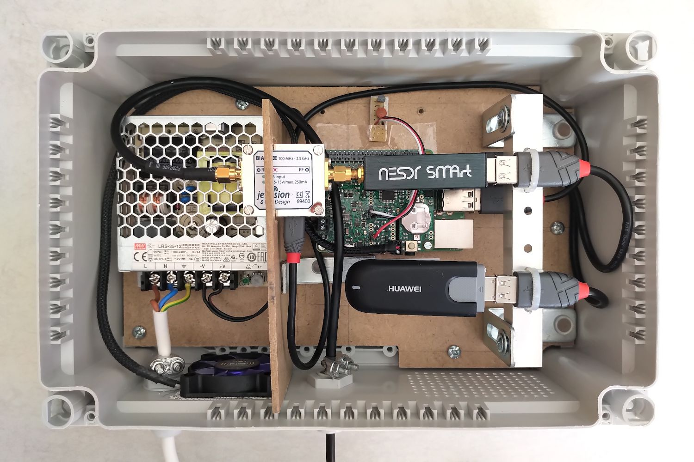

Raspberry Pi Station
====================

The purpose of the Raspberry Pi Station is to provide an _all-in-one_ ready-to-use station for
exterior (or interior) 24/24h, 7/7d use-cases, powered by the facility (AC) or solar panels.

   

It is not meant to be the cheapest possible solution but rather something that is:
- _easy_ to assemble
- by _anyone_ with basic do-it-yourself skills
- using _commodity_ components readily available from one's preferred shack
- with a slight emphasis on _reliability_ and _durability_ for "heavy-duty" use-cases

The demonstrated use-case is a [FLARM receiver for the Open Glider Network (OGN)][ogn], although it
can very easily be adapted to an ADS-B receiver, weather station, etc.

[ogn]: https://www.glidernet.org/

Further details are available in:

* the [hardware](./hardware) section, listing and describing the hardware components

* the [software](./software) section, describing the software setup and configuration fine-tuning
